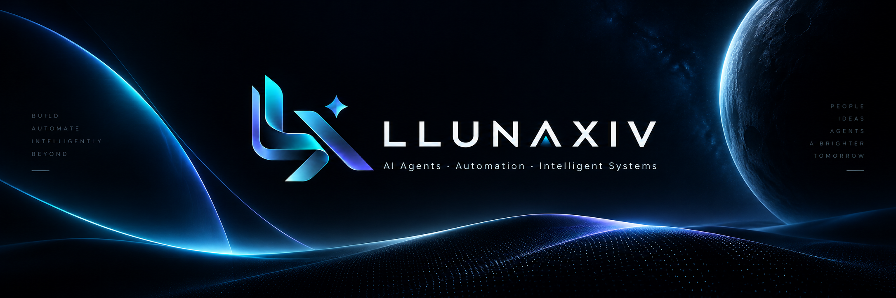

  

# LLUNAXIV

**AI Agents · Automation · Intelligent Systems**

I'm building **MegaSaaS**, a multi-tenant platform focused on AI-powered business automation, intelligent agents, messaging workflows and structured knowledge retrieval.

## What I work on

- AI agent design and evaluation
- LLM response analysis and quality review
- Prompt engineering
- RAG and knowledge retrieval
- Multi-provider AI routing and fallbacks
- WhatsApp automation
- SaaS architecture
- Data extraction, validation and catalog processing
- Software testing and reliability

## Current Project — MegaSaaS

**MegaSaaS** is an AI automation platform designed for businesses that need intelligent conversational agents, structured workflows, knowledge retrieval and messaging automation.

My work includes architecture, testing, AI behavior evaluation, provider comparison, prompt design, workflow design, extraction pipelines and validation of AI-generated results.

## Technologies & AI

**AI / LLMs:** OpenAI · Gemini · DeepSeek · Qwen · MiMo - Claude 
**Backend & Data:** Node.js · PostgreSQL · Supabase  
**Frontend:** React · Next.js · TypeScript  
**AI Systems:** RAG · AI Agents · Prompt Engineering · LLM Evaluation  
**Automation:** WhatsApp · Business Workflows · Data Extraction

## Professional focus

I'm especially interested in opportunities related to:

**AI Training · LLM Evaluation · AI Agents · Automation · SaaS · Data Quality · Prompt Engineering**

---

**LLUNAXIV** — Building intelligent systems for real-world business automation.
